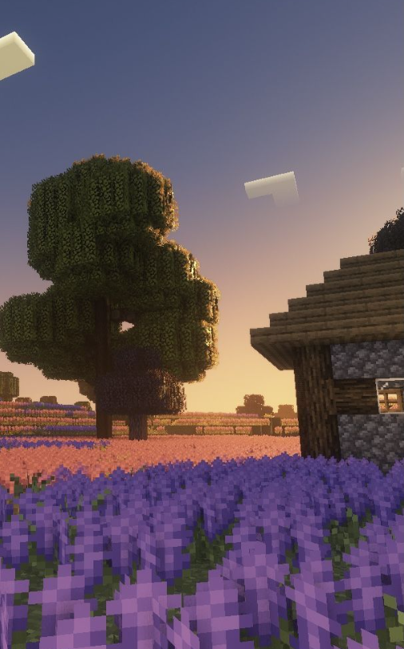

<html lang="ru">
<head>
    <meta charset="UTF-8">
    <meta name="viewport" content="width=device-width, initial-scale=1.0">
    <link rel="stylesheet" href="styles.css">
    <title>О игре</title>
    
</head>
<body>
    <h1>О нашей игре</h1>
    
Творческая игра, в которой основное внимание уделяется строительству.

    
    <h2>Трейлер игры</h2>
    <video width="600" controls>
        <source src="ScreenRecording_03-12-2025 12-12-14_1.mov" type="vid">
        Ваш браузер не поддерживает видео.
    </video>
    

        <h2>Обратная связь</h2>
        <form id="contact-form">
            <input type="text" id="name" placeholder="Имя" required>
            <input type="email" id="email" placeholder="Email" required>
            <textarea id="message" rows="4" placeholder="Сообщение" required></textarea>
            <button type="submit">Отправить</button>
        </form>
        
Ваше сообщение принято, мы скоро ответим!

    

    

        <h2>Галерея</h2>
        
        
        
        
        
    

    

        <h2>Часто задаваемые вопросы (FAQ)</h2>
        <h3 onclick="toggleFAQ(1)">Как установить игру?</h3>
        
Инструкции по установке игры можно найти на странице загрузки.

        <h3 onclick="toggleFAQ(2)">Есть ли системные требования?</h3>
        
Да, минимальные системные требования указаны на странице игры.

        <h3 onclick="toggleFAQ(3)">Как связаться с поддержкой?</h3>
        
Вы можете связаться с нами через форму обратной связи или по email.

    

    
</body>
</html>
