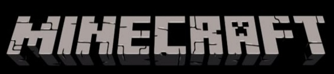
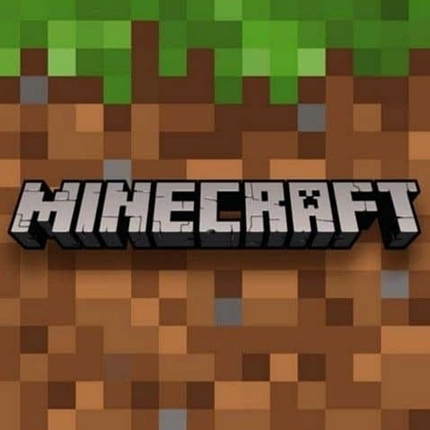
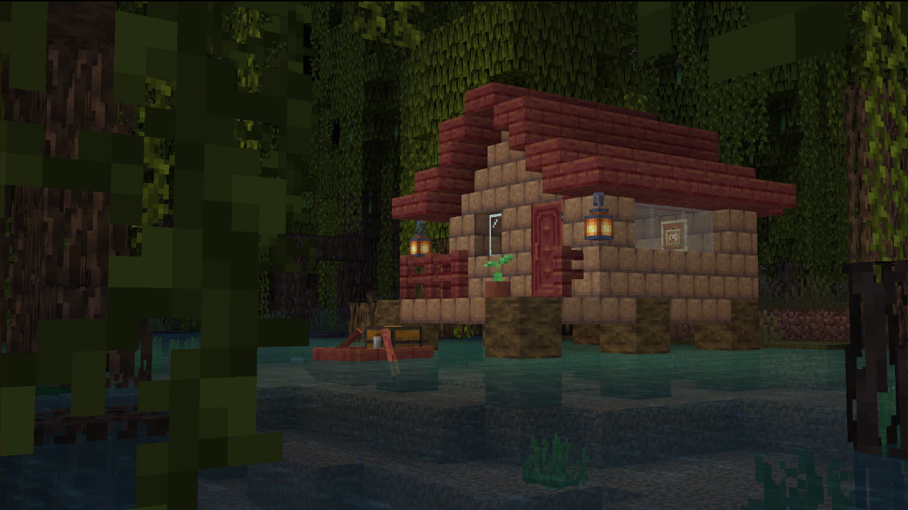

<html lang="ru">
<head>
    <meta charset="UTF-8">
    <meta name="viewport" content="width=device-width, initial-scale=1.0">
    <title>Minecraft - Официальный сайт</title>
    
    </head>
    <body>

    <a href="2part.html">О игре</a>

<body>
    <button id="theme-toggle">Поменять тему</button>
    <header>
         <!-- Логотип -->
        <nav>
             <!-- Иконка 1 -->
             <!-- Иконка 2 -->
        </nav>
    </header>
    <main>
        <h1>Добро пожаловать в Minecraft!</h1>
        <h2>Скриншоты игрового процесса</h2>
         <!-- Скриншот 1 -->
         <!-- Скриншот 2 -->
        <!-- Модальное окно -->
        

            

                &times;
                
Добро пожаловать в наш великолепный сайт!

            

        

        <!-- Раздел новостей и комментариев -->
        <section id="news-section">
            <h2>Новости</h2>
            

                <h3>Вышло новое обновление Minecraft!</h3>
                
1. У свиней появились новые окрасы

                
2. Листья начали опадать

                

                    <h4>Комментарии:</h4>
                    

                        <b>игрок1:</b> шикарное обновление!
                    

                    

                        <b>игрок2:</b> очень понравилось!
                    

                

                <!-- Форма для добавления комментария -->
                <form id="comment-form">
                    <input type="text" id="comment-name" placeholder="Ваше имя">
                    <textarea id="comment-text" placeholder="Ваш комментарий"></textarea>
                    <button type="button" onclick="addComment()">Отправить</button>
                </form>
            

        </section>
    </main>
    
</body>

